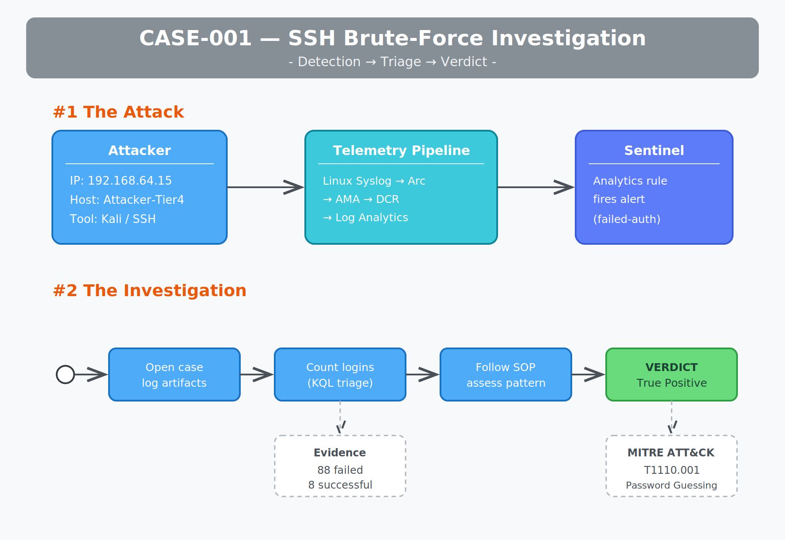

# Threat Investigation Vault

A local-first, Markdown-based investigation workspace for SOC analysis, threat
hunting, and DFIR. Built to structure the full investigation lifecycle
triage, artifact enrichment, playbook execution, and reporting from a single
portable knowledge base.

Designed and maintained by **William** ([@WilliamInCyber](https://x.com/WilliamInCyber)).



## Why this exists

SIEM alerts land in a ticket system; the actual analysis research, artifact
enrichment, decision rationale usually happens in scattered notes. This vault
keeps the *investigation itself* structured, repeatable, and reviewable, grounded
in real lab telemetry rather than theory.

## How it's organized

| Folder        | Purpose                                                        |
|---------------|---------------------------------------------------------------|
| `cases/`      | One self-contained folder per investigation                   |
| `SOPs/`       | Reusable standard operating procedures (triage steps)         |
| `playbooks/`  | Response playbooks referenced by cases                        |
| `templates/`  | Scaffolds for new cases, artifacts, and reports               |
| `artifacts/`  | Global artifact index (IOCs linked across cases)              |
| `dashboards/` | Rollup views of active cases and open tasks                   |

## Investigation lifecycle

```
Alert  ->  Open case  ->  Log artifacts  ->  Enrich  ->  Follow SOP
       ->  Execute playbook (if TP)  ->  Report  ->  Close
```

## Cases

| ID       | Title                                    | Severity | Status |
|----------|------------------------------------------|----------|--------|
| CASE-001 | SSH Brute-Force Against Linux Syslog Host | High     | Closed |

## Usage

Open the folder as an [Obsidian](https://obsidian.md) vault, or browse as plain
Markdown on GitHub. Every case links its SOP, artifacts, and report through
standard Markdown links, so you can click straight through an investigation on GitHub.
